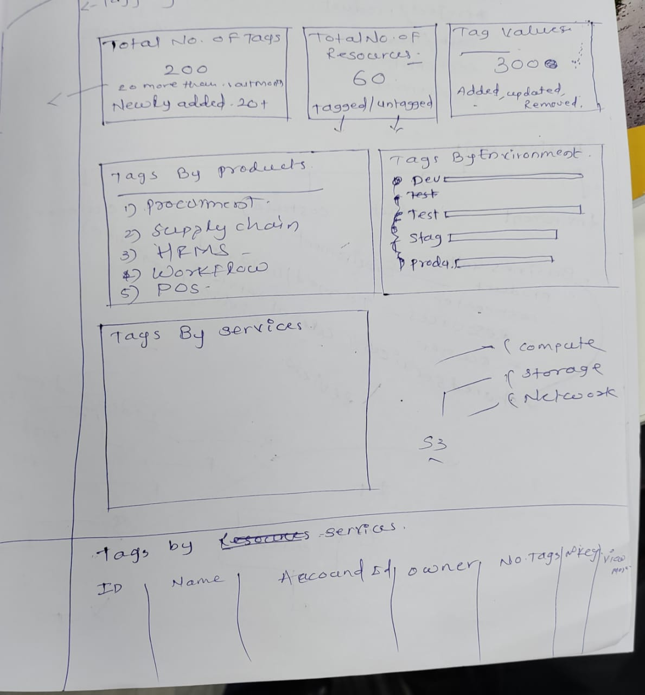

# EC2 Tags

- AMI
- EBS Volumes
- Elastic IP Address
- Instance
- NAT Gateway
- VPC
- VPC Endpoints
- Subnet

## Services Which Do Not Support Tagging

I researched services that do not support tagging.

### Work on Paper Prototype

I worked on a paper prototype to visualize tagging data.

### Next Day Plans

Soon, I'll be working on adding a tag button. Users can tag resources using this button.

### Exploration of AWS Resource Groups Tagging API

I explored the AWS Resource Groups Tagging API. Research links are available on the Miro board.
[Research links are available on the Miro board](https://miro.com/welcomeonboard/dWxjTnlNbTlqcnd3d2h2a1NhN2VFV0pEc1c4SWJCWHVVQXJwSnZMcGE5angxRG5zRG1xUDVXNXNzaFg4VVM4OXwzNDU4NzY0NTU5NzQ3MjQwNjg1fDI=?share_link_id=589078266054)

