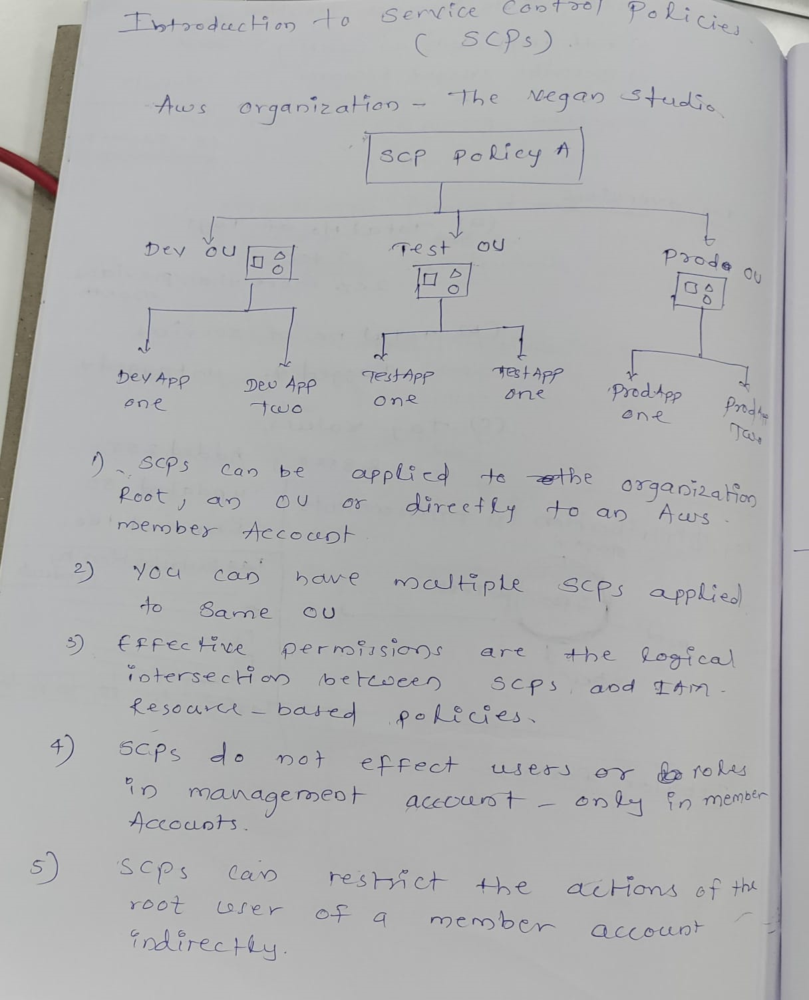
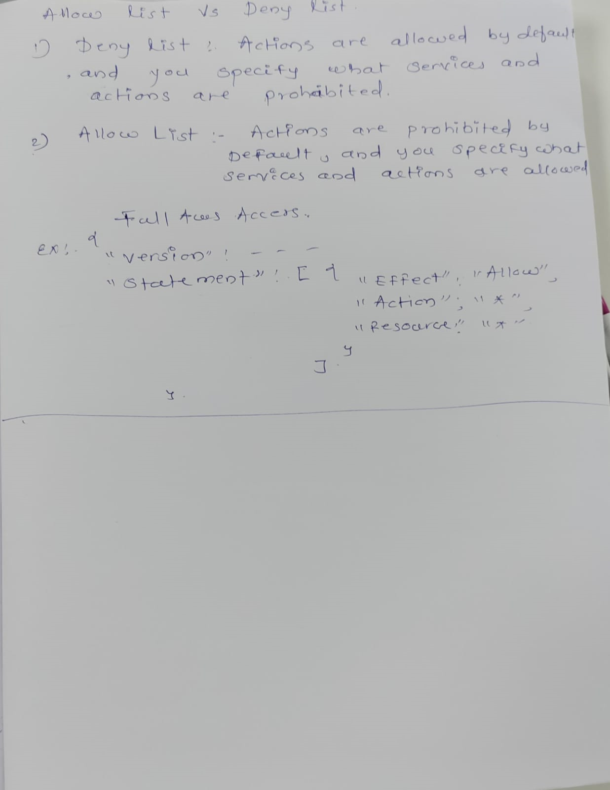

Tagging research:

Miro Board Link:  https://miro.com/welcomeonboard/dWxjTnlNbTlqcnd3d2h2a1NhN2VFV0pEc1c4SWJCWHVVQXJwSnZMcGE5angxRG5zRG1xUDVXNXNzaFg4VVM4OXwzNDU4NzY0NTU5NzQ3MjQwNjg1fDI=?share_link_id=589078266054

Research Topic:

Tag: 1. AWS defined tags
     2. User defined tags
     3. Tagging Categories
     4. Tag policies
     5. Tagging Strategy
     6. Services that support the Resource Groups Tagging 
     7. Auto Tagging
     8. TagOptions
     9. Using TagOptions with AWS Organizations tag policies.
     

     DATE: 07-03-2024.

    10. EC2 tags: 
                 - AMI 
                 - EBS Volumes
                 - Elastic IP Address
                 - Instance
                 - NAT Gateway
                 - VPC 
                 - VPC End_points 
                 - Subnet.

    11. I did research on Services which does not support tagging. 
    12. "Worked on paper prototype. How to visualize tagging data"
       
    13. "Soon I'll be working on adding a tag button. Users can tag resources using this button."
    14. Explored "AWS Resource Groups Tagging API. 
    15. Reaserch Links are available On the miro board. 

    DATE: 08-03-2024.

    16. Today I have watched  tagging and scp tutorial "https://www.youtube.com/watch?v=JT9YLq3NCh4".
    17. I did research on finops https://www.infra360.io/industries/it-telecom. 
    18  
    19. 
    20  https://www.vertice.one/product/cloud-cost-optimization. 
    21. Research Links are available on the miro board. 

    DATE: 12-03-2024.

    22.  I did research on Create tag button. 
    23.  Learned about which aws service supports tagging. 
    24. Research Links are available on the miro board. 
    
    DATE: 18-06-2024.

    25. I did research on the difference between tagged and untagged services. 
    26. I worked on Ec2 internal page. 
    27. Alert messages for tagging.  
    28. Research links are available on the miro board. 

    
    29. "I did research on Lambda function tagging. You can find more information in the AWS documentation:
          -https://docs.aws.amazon.com/lambda/latest/dg/configuration-tags.html"
    30. https://docs.aws.amazon.com/lambda/latest/dg/configuration-tags.html#configuration-tags-cli
    31. https://docs.aws.amazon.com/lambda/latest/dg/configuration-tags.html#using-tags-with-the-console
    32. Viewing tags on a function.
    33. If you want to view the tags that are applied to a specific Lambda function, you can use either of the following AWS CLI         commands:
        ListTags – To view a list of the tags associated with this function. 
        GetFunction – To view a list of the tags associated with this function.

    34. I worked on chargeback module use cases and algorithms.
        https://teams.microsoft.com/l/message/19:66140e15-a263-4f76-a4bc-2a24925e08b6_66be94b9-b6b1-4288-b4d7-ddd841e3321a@unq.gbl.spaces/1711433524064?context=%7B%22contextType%22%3A%22chat%22%7D

    
    

